# Лабораторная 2: Детектирование объекта

## Задание

Необходимо реализовать два примитивных детектора объектов на
изображении, работающих с помощью поиска эталона на входном
изображении.
1. Прямой поиск одного изображения на другом (template matching)
2. Поиск ключевых точек эталона на входном изображении (например, с
помощью SIFT, ORB..)

Программа должна принимать на вход два изображения, эталон и то, на
котором будет производиться поиск. На выходе программа должна строить
рамку в виде четырехугольника в области, где с наибольшей вероятностью
находится искомый объект. Необходимо протестировать оба варианта
программы на разных изображениях (например, сначала в качестве эталона
использовать вырезанный фрагмент входного изображения, а затем
изображение какого-либо предмета сцены, присутствующего на входном
изображении, но сфотографированного с другого ракурса или с другим
освещением), не менее 10 тестовых примеров.

## Теоретическая база

Была разработана система детектирования объектов двумя способами:
1. Поиск шаблона на изображении (Template matching)
2. Поиск ключевых точек на изображении (ORB)

### Template Matching
Template matching — это метод нахождения эталона на исходном изображении. 
Суть заключается в том, что изображение шаблона последовательно накладывается на исходное изображение и между ними вычисляется корреляция,
результат которой заносится в результирующее изображение. 
Так, функция возвращает изображение, где каждый пиксель обозначает сходство между фрагментами в зависимости от выбранного метода корелляции.

В данной работе в качестве метода сравнения использовалась нормализованная взаимная корелляция (NCC) ввиду большей эффективности работы при заданном эталоне.
Основная идея NCC заключается в том, чтобы нормализовать шаблон и область большего изображения перед выполнением кросс-корреляции. 
Это делается путем вычитания среднего значения шаблона и области из каждого пикселя, а затем деления результата на стандартное отклонение шаблона и области.
Этот шаг нормализации помогает уменьшить влияние вариаций освещения и контраста на показатель сходства.

### ORB
ORB (Oriented FAST and Rotated BRIEF) — это дескриптор функции, используемый в компьютерном зрении и обработке изображений.
Это двоичный дескриптор, основанный на детекторе функций FAST (Features from Accelerated Segment Test) и дескрипторе BRIEF (Binary Robust Independent Elementary Features).

FAST (Features from Accelerated Segment Test) – алгоритм поиска ключевых точек. 
Основная идея FAST заключается в использовании круглой области вокруг пикселя для быстрого и эффективного обнаружения углов.
Алгоритм сравнивает яркость рассматриваемого пикселя с пикселями в окружности пикселей вокруг него.
Если рассматриваемый пиксель ярче или темнее, чем определенное количество пикселей в круге, он считается углом или характерной точкой.
Этот процесс повторяется для всех пикселей изображения.

После нахождения ключевых точек необходимо вычислить их дескрипторы – наборы признаков, характеризующие окрестность каждой точки. Для этого подходит алгоритм BRIEF. 
Здесь основная идея заключается в сравнении яркостей пар пикселей в небольшой окрестности вокруг каждой ключевой точки и кодировании результатов в виде двоичного кода (ярче – 1, нет – 0). 
Результат – набор двоичных строк, по одной для каждой ключевой точки. 

## Описание разработанной системы

### Template Matching

Алгоритм: 
1. С помощью метода cv2.matchTemplate() определяем, где вероятнее всего находится объект.
2. Для определения глобального максимума используем cv2.minMaxLoc() и приравниваем к нему левый верхний угол рамки.
3. Вычисляем правый нижний угол, строим рамку.
4. Выводим результат на экран.

```angular2html
def findObject(template, img):
    w, h = template.shape[::-1]
    result = cv2.matchTemplate(img, template, eval('cv2.TM_CCORR_NORMED'))
    _, max_val, _, max_loc = cv2.minMaxLoc(result)
    top_left = max_loc
    bottom_right = (top_left[0] + w, top_left[1] + h)
    cv2.rectangle(img, top_left, bottom_right, 0, 10)
    titles = ['Эталон', 'Сопоставление', 'Обнаруженный объект']
    images = [template, result, img]
    for i in range(3):
        plt.subplot(1, 3, i + 1), plt.imshow(images[i], cmap='gray')
        plt.title(titles[i])
        plt.xticks([]), plt.yticks([])
    return plt
```

### ORB

1. Инициализируем ORB-объект методом cv2.ORB_create().
2. Находим ключевые точки и вычисляем дескрипторы как для эталона, так и для изображения, с помощью orb.detectAndCompute().
3. Инициализируем cv2.BFMatcher() с высчитыванием расстояния Хэмминга.
4. Для нахождения соответствий между дескрипторами выполняем bf.match().
5. Сортируем соответствия по возрастанию расстояния Хэмминга.
6. Отрисовываем первые 25 соответствие.
7. Для нахождения координат рамки перебираем каждое из 25 соответствий и находим минимальные и максимальные значения точек по осям Х и У.
8. Отрисовываем рамку.
9. Выводим результат на экран.

```angular2html
def findObject(template, img):
    orb = cv2.ORB_create()
    kp_template, des_template = orb.detectAndCompute(template, None)
    kp_img, des_img = orb.detectAndCompute(img, None)
    bf = cv2.BFMatcher(cv2.NORM_HAMMING, crossCheck=True)
    matches = bf.match(des_template, des_img)
    matches = sorted(matches, key=lambda x: x.distance)
    result = cv2.drawMatches(template, kp_template, img, kp_img, matches[:25], None,
                             flags=cv2.DrawMatchesFlags_NOT_DRAW_SINGLE_POINTS)

    x_min = x_max = y_min = y_max = 0
    for m in matches[:25]:
        # template_idx = m.queryIdx  # индексы kp_template
        img_idx = m.trainIdx  # индексы kp_img
        (x1, y1) = kp_img[img_idx].pt
        if x_min == 0 and y_min == 0:
            x_min = x1
            y_min = y1
        x_max = max(x_max, x1)
        x_min = min(x_min, x1)
        y_max = max(y_max, y1)
        y_min = min(y_min, y1)
    img = cv2.rectangle(img, (int(x_min), int(y_min)), (int(x_max), int(y_max)), (255, 0, 0), 10)

    titles = ['Сопоставление', 'Обнаруженный объект']
    images = [result, img]
    for i in range(2):
        plt.subplot(1, 2, i + 1), plt.imshow(images[i])
        plt.title(titles[i])
        plt.xticks([]), plt.yticks([])
    return plt
```

## Результаты работы и тестирования системы

Изображение эталона: 
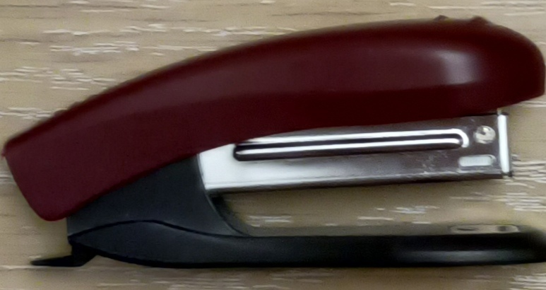

### Template Matching

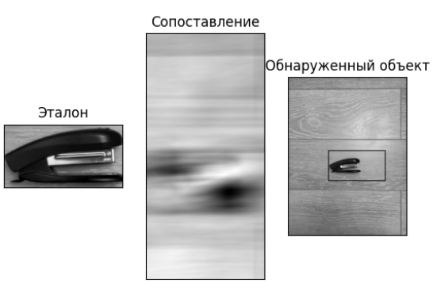
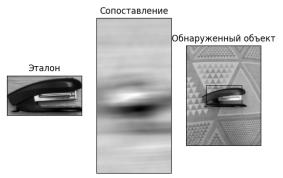
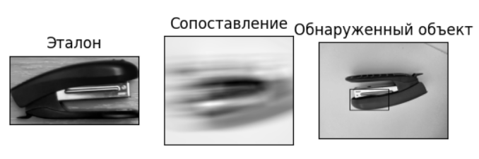
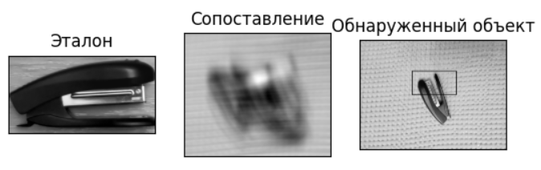
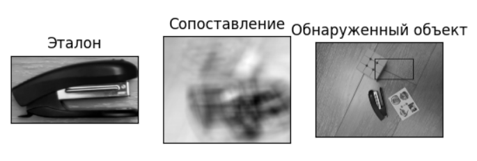
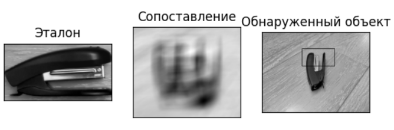
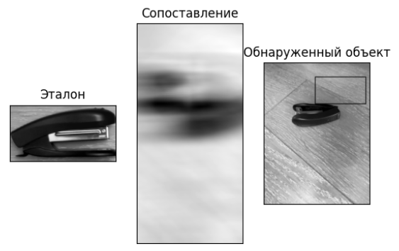
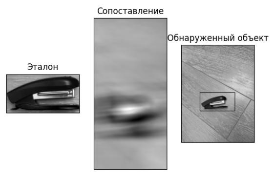

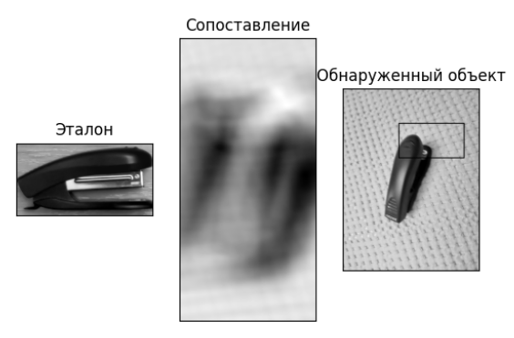

### ORB

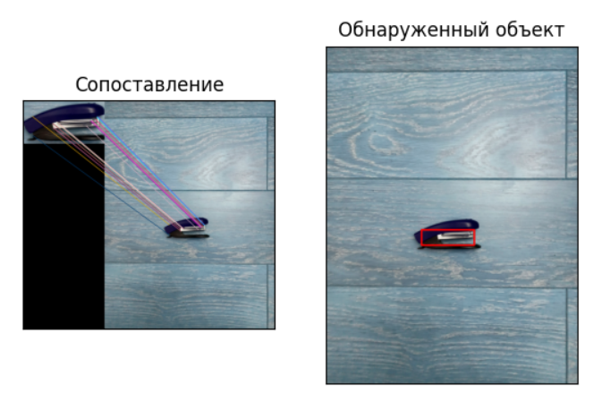
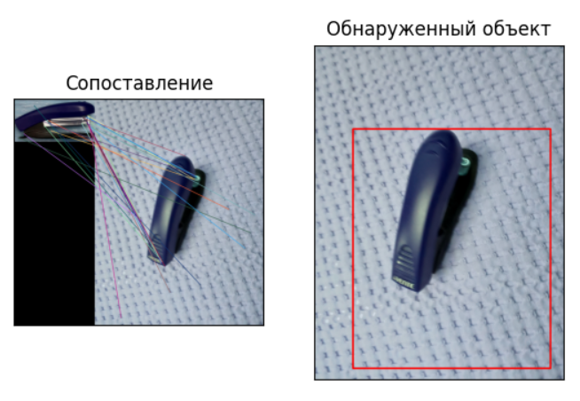
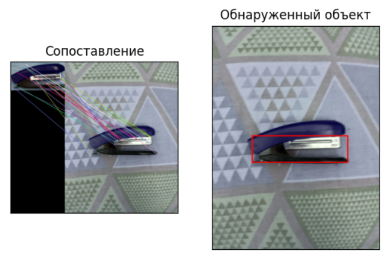
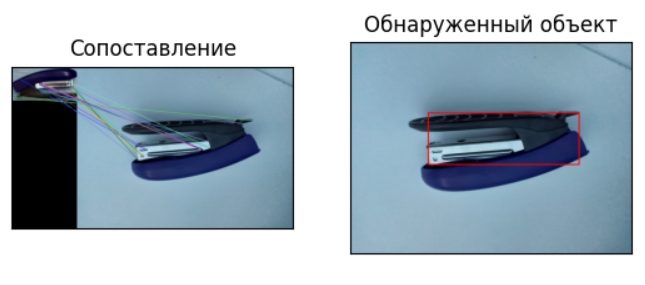
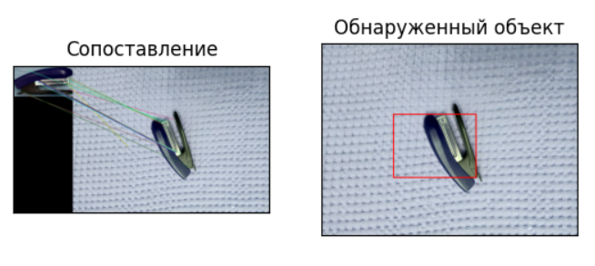
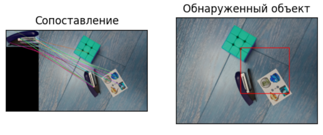
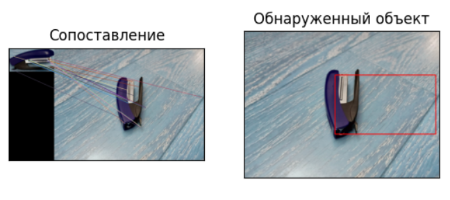
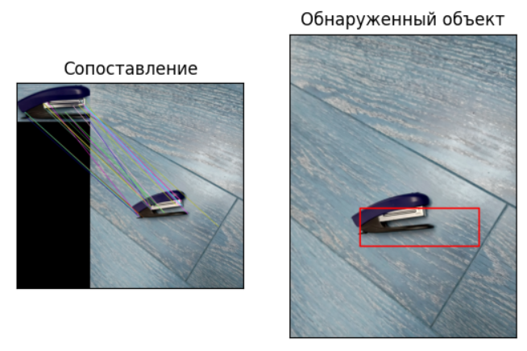
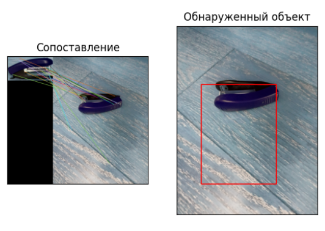
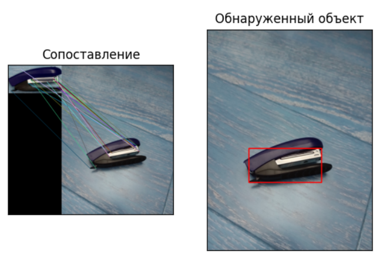

## Выводы по работе

В результате выполнения лабораторной работы было рассмотрено 2 подхода к детектированию объектов. 
Оба алгоритма показали низкую эффективность, однако, если смотреть не на конечный результат с рамкой, а на сопоставление, то можно сказать, что с работой лучше справился ORB.
Большинство ключевых точек сопоставлены верно, и проблема кроется скорее в алгоритме построения рамки.

## Использованные источники

1. https://docs.opencv.org/4.x/dc/dc3/tutorial_py_matcher.html
2. https://docs.opencv.org/3.4/d1/d89/tutorial_py_orb.html
